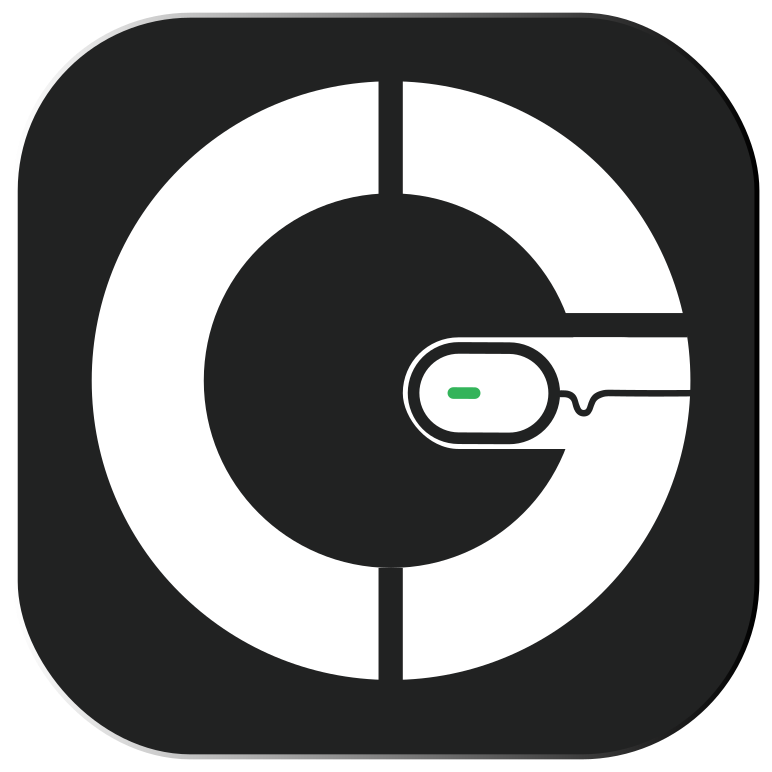

 

   

<h1 align="center">Gladepik</h1>

  
  
  
  
  
  

 
 

🔭 Established in October 2021, Gladepik has rapidly emerged as a leading software development firm, renowned for its commitment to delivering high-quality, innovative solutions. Our expertise spans a wide range of platforms, including web applications, web servers, mobile applications (iOS and Android), and desktop applications.

At Gladepik, we leverage advanced technologies and industry-leading best practices to develop software that is both highly functional and visually compelling. Our team of skilled developers and engineers is committed to understanding each client's unique needs, delivering customized solutions that consistently exceed expectations. Every project we undertake is driven by our focus on efficiency, scalability, and performance, ensuring that your software is both reliable and future-ready.

Whether you’re looking to modernize existing systems, launch a new product, or elevate your digital presence, Gladepik is your trusted technology partner. We are dedicated to building long-term relationships based on trust, collaboration, and exceptional results.

🚀 Our Approach:
------------------

* ⚡ &emsp;`Comprehensive Insight:` We take the time to understand your business objectives, target audience, and specific requirements, enabling us to craft software solutions that align perfectly with your vision.
* ⚡ &emsp;`Agile Methodology:` We adopt agile development practices to maintain flexibility, transparency, and continuous improvement throughout the project lifecycle.
* ⚡ &emsp;`Quality Assurance:` Our rigorous quality assurance processes ensure that every product we deliver meets the highest standards of functionality and performance.
* ⚡ &emsp;`Scalability at the Core:` We design solutions with future growth in mind, ensuring that your software can scale alongside your business.

🤝 Why Choose Gladepik?
--------------------------

* 🌱 &emsp;`Technical Expertise:` Our team brings extensive experience across a wide range of programming languages, frameworks, and platforms.
* 🌱 &emsp;`Commitment to Innovation:` We remain at the forefront of emerging trends and technologies, ensuring our solutions are innovative and forward-thinking.
* 🌱 &emsp;`Client-Centric Focus:` We prioritize your satisfaction, offering exceptional customer service and support throughout your project journey.
* 🌱 &emsp;`Results-Oriented:` Our goal is to deliver tangible results that drive your business growth and success.

🪪 𝐀𝐝𝐝𝐢𝐭𝐢𝐨𝐧𝐚𝐥 𝐈𝐧𝐟𝐨𝐫𝐦𝐚𝐭𝐢𝐨𝐧:
--------------------------------
* :computer: &emsp;Most used line of code `console.log("hello world")`  
* :e-mail: &emsp;You can contact me at [`gladepikagency@gmail.com`](mailto:gladepikagency@gmail.com) 
* 🏢 &emsp;Fun fact: I co-founded my largest digital marketing agency Gladepik.
* 🌍 &emsp;I'm based in Bangladesh
* 🖥️ &emsp;See at [`Website`](http://gladepik.com)

📬 Partner with Us for Success.
----------------------------

Get in touch with us today to explore how Gladepik can help you achieve your business goals through innovative software solutions.

This version emphasizes professionalism, clear value propositions, and a refined tone. It strengthens the language to appeal to clients seeking serious, long-term partnerships in software development.

 
